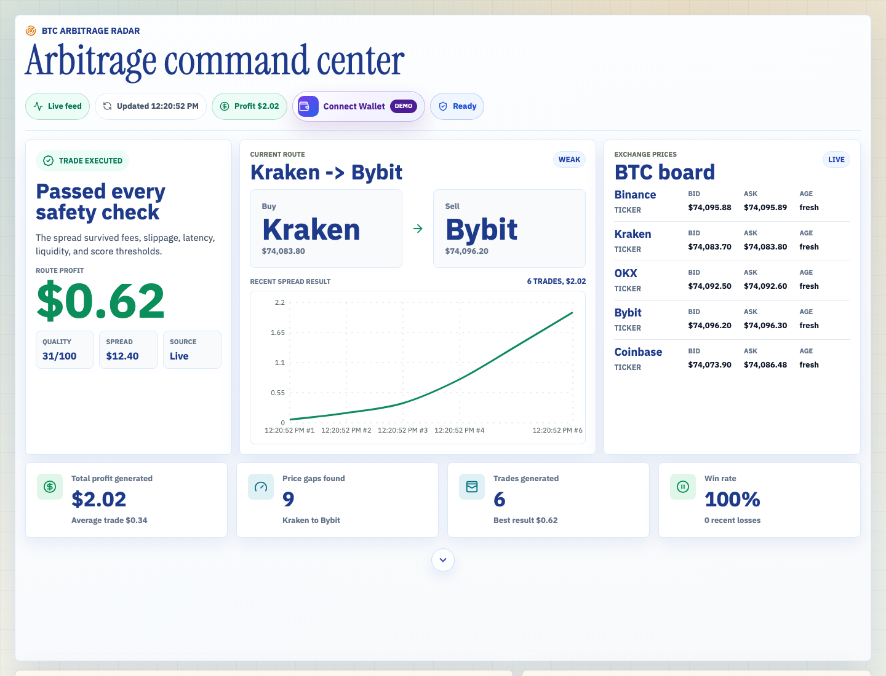
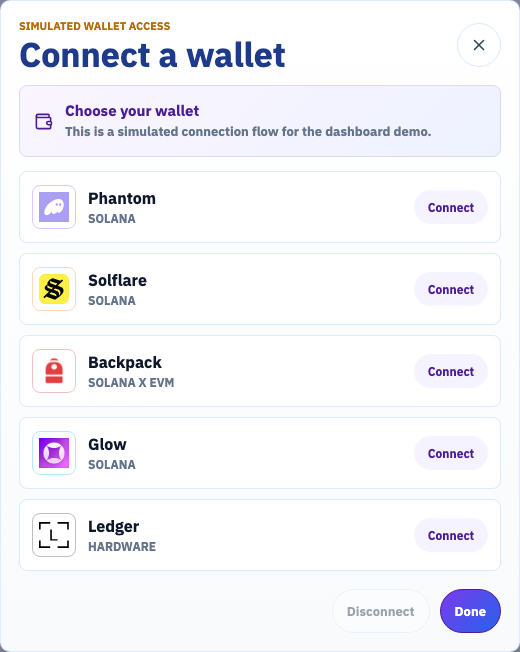
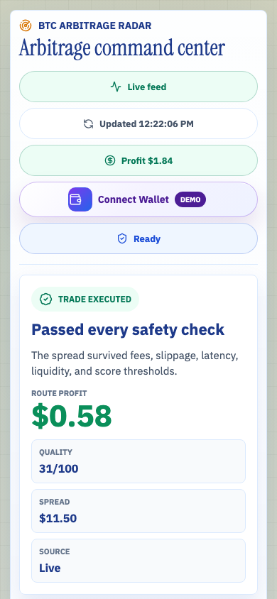

<a id="readme-top"></a>

[![Next.js][Next.js]][Next-url]
[![React][React.js]][React-url]
[![TypeScript][TypeScript]][TypeScript-url]
[![Vercel][Vercel]][Vercel-url]

<br />
<div align="center">
  <h3 align="center">BTC Arbitrage Radar</h3>

  <p align="center">
    Dashboard serverless para monitorear oportunidades de arbitraje de BTC entre exchanges públicos.
    <br />
    <a href="#getting-started"><strong>Ver instalación »</strong></a>
    <br />
    <br />
    <a href="#screenshots">Capturas</a>
    ·
    <a href="#usage">Uso</a>
    ·
    <a href="#deployment">Deploy en Vercel</a>
  </p>
</div>

## Table of Contents

1. [About The Project](#about-the-project)
2. [Built With](#built-with)
3. [Screenshots](#screenshots)
4. [Getting Started](#getting-started)
5. [Usage](#usage)
6. [Project Structure](#project-structure)
7. [Deployment](#deployment)
8. [Roadmap](#roadmap)
9. [Contributing](#contributing)
10. [License](#license)
11. [Acknowledgments](#acknowledgments)

## About The Project

[![BTC Arbitrage Radar Screen Shot][product-screenshot]](docs/screenshots/dashboard-desktop.png)

BTC Arbitrage Radar es una aplicación Next.js lista para desplegarse en Vercel. Permite visualizar precios de BTC, detectar rutas de compra/venta entre exchanges, puntuar oportunidades por spread, liquidez y latencia, y mostrar el profit generado desde un dashboard operacional.

El proyecto ya no requiere un backend persistente. La lógica activa vive en rutas serverless de Next.js bajo `apps/web/app/api`, y el dashboard consume únicamente endpoints relativos como `/api/state`, `/api/health` y `/api/metrics`.

Características principales:

- Monitoreo de Binance, Kraken, OKX, Bybit y Coinbase.
- Detección de oportunidades de arbitraje BTC/USDT.
- Registro de ejecuciones generadas sin API keys privadas.
- Métricas de profit generado, win rate, balances y rutas recientes.
- Fallbacks de mercado cuando un exchange público no responde.
- Deploy compatible con Vercel sin Express, Socket.IO ni proceso long-running.

<p align="right">(<a href="#readme-top">back to top</a>)</p>

## Built With

- [![Next][Next.js]][Next-url]
- [![React][React.js]][React-url]
- [![TypeScript][TypeScript]][TypeScript-url]
- [![Vercel][Vercel]][Vercel-url]
- [Recharts](https://recharts.org/)
- [lucide-react](https://lucide.dev/)
- Public exchange REST APIs

<p align="right">(<a href="#readme-top">back to top</a>)</p>

## Screenshots

### Dashboard principal



Vista desktop del command center con estado del feed, ruta actual, tablero de precios, profit chart, contador de profit generado, CTA de wallet y estado de riesgo.

### Conexión de wallet



Popup simulado para elegir entre Phantom, Solflare, Backpack, Glow y Ledger. El flujo no conecta wallets reales.

### Vista mobile



Vista responsive del dashboard con el contenido principal reorganizado para pantallas estrechas.

<p align="right">(<a href="#readme-top">back to top</a>)</p>

## Getting Started

Estas instrucciones levantan el proyecto localmente con la misma arquitectura usada para Vercel: Next.js + API routes serverless.

### Prerequisites

- Node.js 20 o superior
- npm 10 o superior

Comprueba tus versiones:

```bash
node --version
npm --version
```

### Installation

1. Clona el repositorio.

```bash
git clone <repository-url>
cd btc-bot
```

2. Instala dependencias.

```bash
npm install
```

3. Ejecuta el entorno local.

```bash
npm run dev
```

4. Abre la aplicación.

```text
http://localhost:3000
```

### Optional Configuration

La app funciona sin variables de entorno. Si quieres ajustar la evaluación serverless, puedes definir:

```bash
MIN_PROFIT=0.01
MIN_SCORE=20
MIN_VOLUME_BTC=0.001
MAX_LATENCY_MS=1000
SIMULATION_VOLUME_BTC=0.05
RADAR_FETCH_TIMEOUT_MS=2500
```

<p align="right">(<a href="#readme-top">back to top</a>)</p>

## Usage

Comandos principales:

```bash
npm run dev
npm run typecheck
npm run build
```

Endpoints locales:

```text
GET http://localhost:3000/api/state
GET http://localhost:3000/api/health
GET http://localhost:3000/api/metrics
```

`/api/state` devuelve el payload usado por el dashboard:

- `market`: snapshots normalizados por exchange.
- `opportunities`: rutas de arbitraje ordenadas por score.
- `trades`: ejecuciones generadas en el ciclo actual.
- `balances`: balances tras la evaluación.
- `metrics`: profit generado, trades generados, win rate y conteos por exchange.

<p align="right">(<a href="#readme-top">back to top</a>)</p>

## Project Structure

```text
.
├── apps
│   ├── server              # legado; no se despliega en Vercel
│   └── web
│       ├── app
│       │   ├── api
│       │   │   ├── health
│       │   │   ├── metrics
│       │   │   └── state
│       │   ├── globals.css
│       │   ├── layout.tsx
│       │   └── page.tsx
│       ├── lib
│       │   └── radar.ts
│       └── package.json
├── docs
│   └── screenshots
├── package.json
├── package-lock.json
├── vercel.json
└── tsconfig.base.json
```

La lógica activa está en `apps/web/lib/radar.ts`. Ese módulo consulta APIs públicas, arma snapshots, calcula oportunidades y genera métricas para las rutas serverless.

<p align="right">(<a href="#readme-top">back to top</a>)</p>

## Deployment

El proyecto está preparado para Vercel desde la raíz del repositorio.

Configuración relevante:

- `package.json` usa solo `apps/web` como workspace activo.
- `npm run build` compila la app web.
- `vercel.json` define `outputDirectory` como `apps/web/.next`.
- `.vercelignore` excluye `apps/server`.
- No se necesita `NEXT_PUBLIC_SERVER_URL`, `PORT`, `WEB_ORIGIN`, Socket.IO ni URL de backend externo.

Pasos recomendados:

1. Importa el repositorio en Vercel.
2. Usa la raíz del repositorio como root directory.
3. Deja el build command como `npm run build`.
4. Despliega.

<p align="right">(<a href="#readme-top">back to top</a>)</p>

## Roadmap

- [x] Migrar el dashboard a rutas serverless de Next.js.
- [x] Eliminar la dependencia del backend Express para despliegue.
- [x] Agregar health, state y metrics como API routes.
- [ ] Añadir tests automatizados para `apps/web/lib/radar.ts`.
- [x] Añadir más capturas para mobile y vistas secundarias.

<p align="right">(<a href="#readme-top">back to top</a>)</p>

## Contributing

1. Crea una rama para tu cambio.

```bash
git checkout -b feature/my-change
```

2. Valida tipos y build.

```bash
npm run typecheck
npm run build
```

3. Abre un pull request con una descripción clara del cambio y capturas si afecta la UI.

<p align="right">(<a href="#readme-top">back to top</a>)</p>

## License

No hay archivo de licencia en este snapshot del repositorio.

<p align="right">(<a href="#readme-top">back to top</a>)</p>

## Acknowledgments

- Estructura inspirada en [Best-README-Template](https://github.com/othneildrew/Best-README-Template).
- Next.js App Router y API routes para el runtime serverless.
- APIs públicas de Binance, Kraken, OKX, Bybit y Coinbase.

<p align="right">(<a href="#readme-top">back to top</a>)</p>

[product-screenshot]: docs/screenshots/dashboard-desktop.png
[Next.js]: https://img.shields.io/badge/next.js-000000?style=for-the-badge&logo=nextdotjs&logoColor=white
[Next-url]: https://nextjs.org/
[React.js]: https://img.shields.io/badge/React-20232A?style=for-the-badge&logo=react&logoColor=61DAFB
[React-url]: https://react.dev/
[TypeScript]: https://img.shields.io/badge/TypeScript-3178C6?style=for-the-badge&logo=typescript&logoColor=white
[TypeScript-url]: https://www.typescriptlang.org/
[Vercel]: https://img.shields.io/badge/Vercel-000000?style=for-the-badge&logo=vercel&logoColor=white
[Vercel-url]: https://vercel.com/
