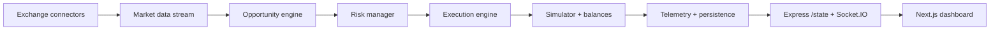

# BTC Arbitrage Radar

BTC Arbitrage Radar is a two-app monorepo for monitoring BTC arbitrage opportunities in real time, scoring them with risk and execution logic, simulating trades against internal balances, and rendering the result in a live dashboard.

It is designed as a paper-first system. The server exposes rollout, risk, telemetry, replay, and state endpoints, while the web app renders the operator view for market snapshots, opportunities, trades, balances, and performance.

## At a Glance

| Area | Purpose |
| --- | --- |
| `apps/server` | Express + Socket.IO backend that ingests exchange prices, detects opportunities, applies risk checks, simulates execution, and persists event history |
| `apps/web` | Next.js dashboard that consumes `/state` and the Socket.IO feed to show the trading cockpit |
| Data flow | Exchange snapshot -> opportunity engine -> risk gate -> execution engine -> simulator -> dashboard |
| Storage | JSONL event and snapshot logs under `apps/server/data` |

## Project Layout

```text
.
├── apps
│   ├── server
│   │   ├── src
│   │   │   ├── config.ts
│   │   │   ├── core
│   │   │   ├── engine
│   │   │   ├── execution
│   │   │   ├── exchanges
│   │   │   ├── guard
│   │   │   ├── persistence
│   │   │   ├── risk
│   │   │   ├── rollout
│   │   │   ├── simulator
│   │   │   ├── telemetry
│   │   │   └── types.ts
│   │   └── data
│   └── web
│       └── app
│           ├── api
│           ├── globals.css
│           ├── layout.tsx
│           └── page.tsx
├── package.json
├── package-lock.json
└── tsconfig.base.json
```

## Architecture



The backend continuously collects order-book snapshots from supported exchanges, compares buy and sell routes, and ranks opportunities by spread, liquidity, latency, and slippage. If a candidate passes risk checks, the execution layer runs a simulated IOC lifecycle and updates balances, trade history, and PnL. The web app subscribes to the resulting state and presents it as an operations dashboard.

## Technology Stack

### Backend
- Node.js
- Express 5
- Socket.IO
- TypeScript
- Public exchange REST and websocket APIs

### Frontend
- Next.js 16
- React 19
- TypeScript
- Recharts
- lucide-react
- socket.io-client

### Tooling
- npm workspaces
- `tsx` for server development
- TypeScript project builds

## Key Features

- Live BTC price snapshots from Binance, Kraken, OKX, Bybit, and Coinbase
- Arbitrage route detection across exchange pairs
- Profit calculation with fees, slippage, and latency inputs
- Risk controls for notional limits, trade frequency, inventory skew, drawdown, and loss streaks
- Simulated execution with wallet balances, trade history, and PnL tracking
- Runtime guard and rollout controls for exchange availability and staged operation
- JSONL persistence for events and snapshots
- Dashboard views for current route, price board, history, balances, opportunities, and trades

## Getting Started

### Prerequisites
- Node.js 20 or newer
- npm 10 or newer

### Install

```bash
npm install
```

### Run both apps

```bash
npm run dev
```

### Open the services
- Web dashboard: `http://localhost:3000`
- Server health: `http://localhost:4000/health`
- Server state: `http://localhost:4000/state`

## Configuration

The server runs with defaults, but these environment variables are supported:

```bash
PORT=4000
WEB_ORIGIN=http://localhost:3000
POLL_INTERVAL_MS=2000
MIN_PROFIT=0.01
MIN_SCORE=20
MIN_VOLUME_BTC=0.001
MAX_LATENCY_MS=1000
SIMULATION_VOLUME_BTC=0.01
MAX_LIVE_NOTIONAL_USDT=1000
MAX_TRADES_PER_MINUTE=5
MAX_RISK_CONSECUTIVE_LOSSES=3
MAX_RISK_DRAWDOWN_USDT=150
MAX_INVENTORY_SKEW_RATIO=0.45
SLO_P95_MARKET_TO_DECISION_MS=1200
SLO_P95_DECISION_TO_INTENT_MS=250
SLO_P95_INTENT_TO_RESULT_MS=900
SLO_BREACH_CONSECUTIVE_LIMIT=2
EXCHANGE_STALE_ALERT_MS=12000
```

Execution flags:

```bash
RUNTIME_PROFILE=paper-fast | sandbox-live | live
EXECUTION_MODE=paper | sandbox | live
ENABLE_SANDBOX_TRADING=true|false
ENABLE_LIVE_TRADING=true|false
```

### Web app

```bash
NEXT_PUBLIC_SERVER_URL=http://localhost:4000
```

## Backend Overview

The server lives in `apps/server/src` and is split into focused modules:

- `exchanges/`: market connectors for Binance, Kraken, OKX, Bybit, and Coinbase
- `services/marketData.ts`: orchestrates connectors, bootstraps fallback snapshots, and normalizes market state
- `engine/`: opportunity detection, arbitrage logic, scoring, and profit calculation
- `risk/`: pre-trade checks, drawdown tracking, loss streak tracking, and kill switch state
- `execution/`: IOC-style execution lifecycle and simulated trade application
- `simulator/`: balances, PnL series, trades, and replay-friendly in-memory state
- `persistence/`: JSONL event and snapshot storage
- `telemetry/`: metrics and runtime signals
- `rollout/`: staged readiness policy and preflight checks
- `guard/`: runtime protection and exchange gating

### Main backend APIs

- `GET /health`
- `GET /health/deep`
- `GET /metrics`
- `GET /state`
- `GET /risk/state`
- `POST /risk/kill-switch`
- `DELETE /risk/kill-switch`
- `GET /replay/events`
- `GET /replay/snapshots`
- `GET /guard/state`
- `POST /guard/alerts`
- `DELETE /guard/alerts`
- `GET /rollout/stage`
- `POST /rollout/stage`
- `GET /rollout/preflight`

## Frontend Overview

The web app lives in `apps/web/app` and renders the operator view:

- The main page subscribes to Socket.IO updates and fetches `/api/state` as a fallback
- The current route panel shows the active buy/sell path and route history
- The price board compares all supported exchanges
- The dashboard surfaces PnL, balances, opportunities, and trade history
- The layout is tuned for dense scanning rather than a marketing-style landing page

## Development Workflow

```bash
npm run dev         # run server and web together
npm run build       # build server, then web
npm run typecheck   # typecheck both apps
npm run lint        # lint the web app
```

Package-level commands:

```bash
npm --workspace apps/server run dev
npm --workspace apps/server run build
npm --workspace apps/server run typecheck

npm --workspace apps/web run dev
npm --workspace apps/web run build
npm --workspace apps/web run typecheck
npm --workspace apps/web run lint
```

The server writes event and snapshot history to `apps/server/data/events.jsonl` and `apps/server/data/snapshots.jsonl`. Those files are used for replay and cold-start recovery.

## Testing and Verification

There is no dedicated test suite in the repository snapshot. The practical verification path is:

```bash
npm run typecheck
npm run build
```

For runtime checks, use:

```bash
curl http://localhost:4000/health
curl http://localhost:4000/state
curl http://localhost:4000/health/deep
```

## Data Model

The core domain types are defined in `apps/server/src/types.ts`:

- `MarketSnapshot`: best bid/ask, sizes, timestamp, and source
- `Opportunity`: route, expected profit, fees, slippage, latency, score, and status
- `Trade`: executed simulation result and realized net profit
- `WalletBalance`: per-exchange BTC and USDT balances
- `RadarState`: the combined market, opportunities, trades, balances, and metrics payload used by the dashboard

## Contributing

When making changes, keep the modules focused and the data flow explicit:

- update market ingestion in `services/marketData.ts` and the relevant exchange connector
- update opportunity math in `engine/`
- update execution behavior in `execution/`
- update safety logic in `risk/`
- update dashboard rendering in `apps/web/app/page.tsx` and `apps/web/app/globals.css`

Use the existing code style as the reference. The repo favors small, typed modules and direct data flow over broad abstraction.

## License

No license file is present in this repository snapshot.
